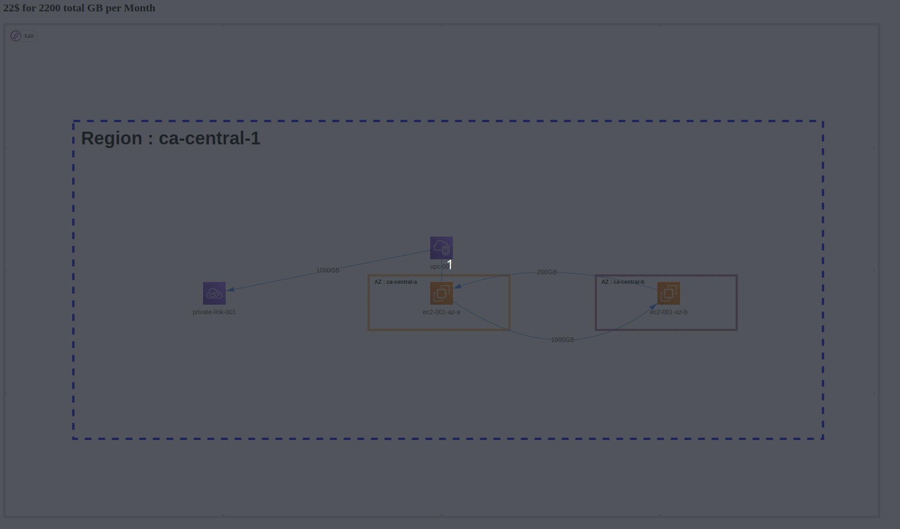

# Traffic cost breakdown
| Traffic pattern 	| Cost 	|
|---	|---	|
| Inter region traffic 	| 0.01 USD Per GB Inbound 0.01 USD Per GB Oubound 	|
| Inter AZ traffic 	| 0.01 USD Per GB Inbound 0.01 USD Per GB Oubound 	|
| Traffic over a TGW between two VPC 	| 0.02 USD per GB for each attachment Traffic coming into the VPC Traffic coming out of the VPC  	|
| Traffic over a Direct Connect 	| 0.02 USD per GB OUT (from AWS to on-premise) 	|
| Traffic over a Private Link endpoint 	| 0.01 USD per GB (IN + OUT) 	|
| Traffic over a NAT Gateway 	| 0.045 USD per GB (IN + OUT) 	|
| Traffic over a Load Balancer (ALB, NLB) 	| Total processed bytes: 100 GB per month x 0.00136986 months in an hour = 0.136986 GB per hour  0.136986 GB per hour / 1 GB per hour for EC2 instances, containers and IP addresses as targets. = 0.136986 Processed bytes LCUs 100 new connections / 600 new connections per LCU = 0.16666666666666666 new connections/flows LCUs 100 new connections x 5 seconds = 500 active GWLB connections 500 active connections / 60000 connections per LCU = 0.008333333333333333 active GWLB connections LCUs Max (0.136986 processed bytes LCUs, 0.16666666666666666 new connections/flows LCUs, 0.008333333333333333 active connections/flows LCUs) = 0.16666666666666666 max GWLB LCUs 0.16666666666666666 GWLB LCUs x 0.004 GWLB LCU price x 730 hours per month = 0.49 USD (Gateway Load Balancer LCU usage) Total LCU charges for all Gateway Load Balancers (monthly): 0.49 USD 	|
| Traffic to an AWS API with PublicVIF from on-premise 	| 0.01 USD Per GB Oubound (from AWS to on-premise) 	|
| Traffic to an AWS API with Private Endpoint from on-premise 	| 0.01 USD per GB (IN + OUT) 	|
| Traffic over VPC peering between regions 	| 0.01 USD Per GB Inbound 0.01 USD Per GB Oubound 	|
| Traffic over VPC peering in the same region 	| Traffic between resources in the same AZ is free 0.01 USD Per GB Oubound 	|

# What is this?
 - AWS will bill you for bandwidth in many different directions.
 - This can be a shock from on-prem where bandwidth/network is absorbed as part of the overall infrastructure.
 - The AWS calculator makes it a bit hard to visualize the flows and direction of traffic.
 - We need to find a way to educate and upskill architecture and service team.
 - Network traffic is well suited to a visual representation.

# Scenario
 - Inter availability-zone traffic between EC2 instances in the same region.
 - Traffic towards a private link towards a third party vendor (not an AWS service).

